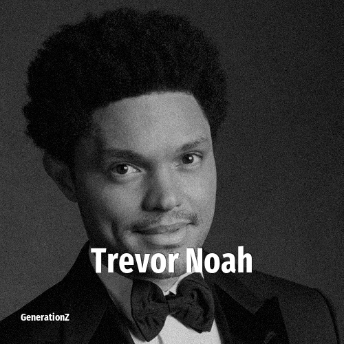

# Trevor Noah

> **Trevor Noah** was born in **1984**, making them a member of the Generation Y. Field: Comedian.

Trevor Noah (born 20 February 1984) is a South African comedian, writer, producer, political commentator, actor, and television host. He was the host of The Daily Show, an American late-night talk show and satirical news program on Comedy Central, from 2015 to 2022. Noah has won various awards, including two Primetime Emmy Awards. He was named one of "The 35 Most Powerful People in New York Media" by The Hollywood Reporter in 2017 and 2018. In 2018, Time magazine named him one of the 100 most influential people in the world.

## Facts

| | |
|---|---|
| Born | 1984 |
| Field | Comedian |
| Country | South-africa |
| Generation | [Generation Y](../generations/millennials/index.md) |
| Born in | [Year 1984](../born-in/1984.md) |
| Wikipedia | [Trevor Noah on Wikipedia](https://en.wikipedia.org/wiki/Trevor_Noah) |
| IMDb | [Trevor Noah on IMDb](https://www.imdb.com/name/nm3696388/) |

----

_Last updated: 2026-09-24_
