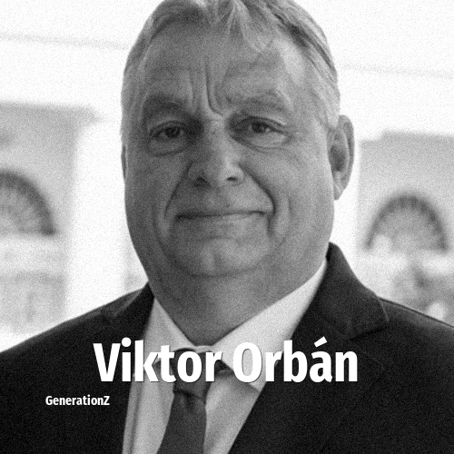

# Viktor Orbán

> **Viktor Orbán** was born in **1963**, making them a member of the Baby Boomers. Field: Politics.

Viktor Mihály Orbán (born 31 May 1963) is a Hungarian lawyer and politician who served as the prime minister of Hungary from 1998 to 2002 and from 2010 to 2026. He has also been the president of Fidesz, which has been variously characterised as a Christian nationalist, illiberal, and far-right political party. He has served as its president since 2003, and previously from 1993 to 2000.

## Facts

| | |
|---|---|
| Born | 1963 |
| Field | Politics |
| Country | Hungary |
| Generation | [Baby Boomers](../generations/baby-boomers/index.md) |
| Born in | [Year 1963](../born-in/1963.md) |
| Wikipedia | [Viktor Orbán on Wikipedia](https://en.wikipedia.org/wiki/Viktor_Orb%C3%A1n) |
| IMDb | [Viktor Orbán on IMDb](https://www.imdb.com/name/nm1476808/) |

----

_Last updated: 2026-09-24_
