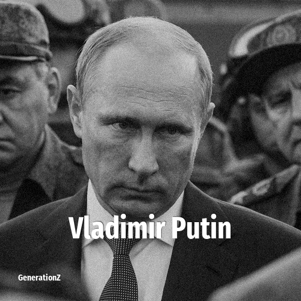

# Vladimir Putin

> **Vladimir Putin** was born in **1952**, making them a member of the Baby Boomers. Field: Politics.

Vladimir Vladimirovich Putin (born 7 October 1952) is a Russian politician and former intelligence officer who has served as President of Russia since 2012, having previously served from 2000 to 2008. Putin also served as Prime Minister of Russia from 1999 to 2000 and again from 2008 to 2012. He has been described as the de facto leader of Russia since 1999.

## Facts

| | |
|---|---|
| Born | 1952 |
| Field | Politics |
| Country | Russia |
| Generation | [Baby Boomers](../generations/baby-boomers/index.md) |
| Born in | [Year 1952](../born-in/1952.md) |
| Wikipedia | [Vladimir Putin on Wikipedia](https://en.wikipedia.org/wiki/Vladimir_Putin) |
| IMDb | [Vladimir Putin on IMDb](https://www.imdb.com/name/nm1269884/) |

----

_Last updated: 2026-09-23_
