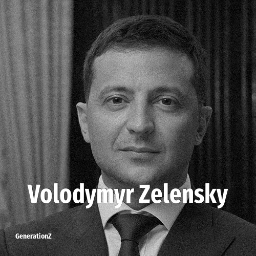

# Volodymyr Zelensky

> **Volodymyr Zelensky** was born in **1978**, making them a member of the Generation X. Field: Politics.

Volodymyr Oleksandrovych Zelenskyy (born 25 January 1978) is a Ukrainian politician and former entertainer who has served as the sixth president of Ukraine since 2019. He took office five years after the start of the Russo-Ukrainian war with Russia's annexation of Crimea and invasion of the Donbas, and has continued to serve during the full-scale Russian invasion of Ukraine, which has been ongoing since February 2022.

## Facts

| | |
|---|---|
| Born | 1978 |
| Field | Politics |
| Country | Ukraine |
| Generation | [Generation X](../generations/generation-x/index.md) |
| Born in | [Year 1978](../born-in/1978.md) |
| Wikipedia | [Volodymyr Zelensky on Wikipedia](https://en.wikipedia.org/wiki/Volodymyr_Zelenskyy) |
| IMDb | [Volodymyr Zelensky on IMDb](https://www.imdb.com/name/nm3305952/) |

----

_Last updated: 2026-09-24_
