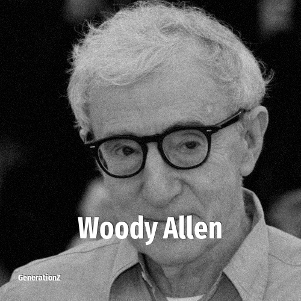

# Woody Allen

> **Woody Allen** was born in **1935**, making them a member of the Silent Generation. Field: Director.

Woody Allen (born Allan Stewart Konigsberg; November 30, 1935) is an American filmmaker, actor, writer, and comedian. In a career spanning more than seven decades, he has written for film, television, and theater. As a screenwriter, Allen holds the record of most wins (3) and nominations (16) for the Academy Award for Best Original Screenplay. In addition to his four Academy Awards, he has also received numerous other accolades, including ten BAFTA Awards, two Golden Globe Awards, a Grammy Award, and nominations for an Emmy Award and a Tony Award. He received an Honorary Golden Lion in 1995, the BAFTA Fellowship in 1997, an Honorary Palme d'Or in 2002, and the Golden Globe Cecil B. DeMille Award in 2014. Two of his films have been inducted into the National Film Registry by the Library of Congress.

## Facts

| | |
|---|---|
| Born | 1935 |
| Field | Director |
| Country | USA |
| Generation | [Silent Generation](../generations/silent-generation/index.md) |
| Born in | [Year 1935](../born-in/1935.md) |
| Wikipedia | [Woody Allen on Wikipedia](https://en.wikipedia.org/wiki/Woody_Allen) |
| IMDb | [Woody Allen on IMDb](https://www.imdb.com/name/nm0000095/) |

----

_Last updated: 2026-09-23_
