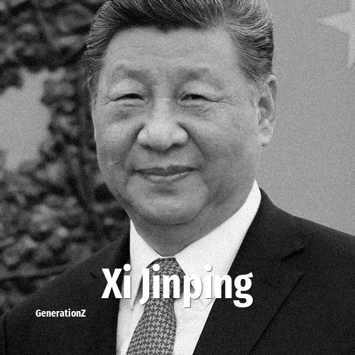

# Xi Jinping

> **Xi Jinping** was born in **1953**, making them a member of the Baby Boomers. Field: Politics.

Xi Jinping (born 15 June 1953) is a Chinese politician who is the paramount leader of China. He has served as the general secretary of the Chinese Communist Party and chairman of the Party Central Military Commission since 2012, and as the president of China and chairman of the State Central Military Commission since 2013.

## Facts

| | |
|---|---|
| Born | 1953 |
| Field | Politics |
| Country | China |
| Generation | [Baby Boomers](../generations/baby-boomers/index.md) |
| Born in | [Year 1953](../born-in/1953.md) |
| Wikipedia | [Xi Jinping on Wikipedia](https://en.wikipedia.org/wiki/Xi_Jinping) |
| IMDb | [Xi Jinping on IMDb](https://www.imdb.com/name/nm7010941/) |

----

_Last updated: 2026-09-24_
