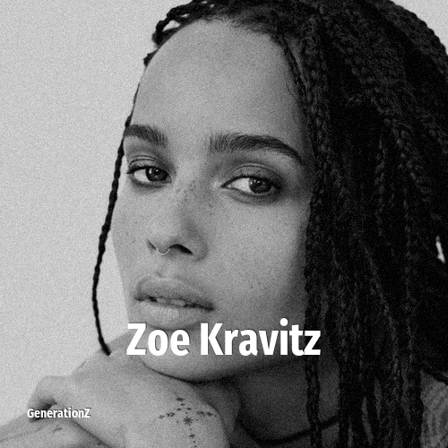

# Zoe Kravitz

> **Zoe Kravitz** was born in **1988**, making them a member of the Generation Y. Field: Actor.

Zoë Isabella Kravitz (born December 1, 1988) is an American actress, singer, and filmmaker. She has received nominations for a Critics' Choice Award, a Primetime Emmy Award, and a Screen Actors Guild Award. In 2022, she was named by Time magazine as one of the 100 Most Influential People.

## Facts

| | |
|---|---|
| Born | 1988 |
| Field | Actor |
| Country | USA |
| Generation | [Generation Y](../generations/millennials/index.md) |
| Born in | [Year 1988](../born-in/1988.md) |
| Wikipedia | [Zoe Kravitz on Wikipedia](https://en.wikipedia.org/wiki/Zo%C3%AB_Kravitz) |
| IMDb | [Zoe Kravitz on IMDb](https://www.imdb.com/name/nm2368789/) |

----

_Last updated: 2026-09-23_
